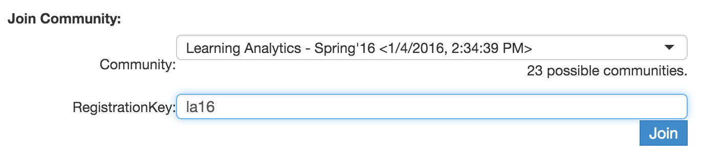

# CI 5330 Section 001 - Learning Analytics in the Knowledge Society

**Spring 2016, Tuesday, 04:40 PM - 07:20 PM**  
**[Lrng & Environmental Sci](https://campusmaps.umn.edu/learning-and-environmental-sciences) R260, St. Paul Campus**

## Instructor Information

**Bodong Chen, Assistant Professor**  
E-mail: chenbd@umn.edu  
Phone/Voicemail: (773) 850-1032  
Office: LTML, 210 Lrng & Environmental Sci, St. Paul  
Office Hours: By Appointment

## Course Description

### Overview

Learning analytics is a nascent field of research that aspires to "turn educational data into actionable knowledge, in order to optimize learning and the environments in which it occurs." This course aims to provide a **general, non-technical** survey of learning analytics, as well as its application in various educational contexts. In particular, we will discuss foundations of the field, explore new forms of assessment, become acquainted with popular data mining techniques, review learning analytical tools and cases, and design/develop new analytic tools by ourselves--all with emphasis on emergent competencies in the knowledge age. Additional supports will be provided for students interested in pursuing specific issues in any of these areas. Overall, this will be a great course for getting a broad overview of the field of learning analytics.

### Audience

The course is designed for a broad audience. All graduate students interested in learning analytics and its application in specific educational areas (e.g., STEM, literacies, life-long learning) are welcomed.

Prerequisites: None, but some prior knowledge in learning theories, assessment, and/or data science recommended.

### Objectives

By the end of the course, students should:

1.	Understand the logic of analytics
2.	Identify and describe key epistemological, pedagogical, ethical, and technical factors related to the design of learning analytics
3.	Be familiar with the basics of finding, cleaning, and using educational data
4.	Understand some of the popular data mining techniques, including predictive models, text analysis, relationship mining, and social networks
5.	Develop beginning skills necessary to plan and design learning analytics
6.  Be able to apply data analytic skills in their own research

## Course Design

### Guiding Philosophy

This is a **Knowledge Building** course, which means all participants (including the instructor) are collectively producing ideas and knowledge as a community, to solve authentic learning analytics problems. Our top-level goal in this course will be to work as a knowledge building team, **living** and **exploring** the capacity of learning analytics in supporting growth in learning in different domains. This overarching goal will be interwoven throughout this course. We will advance this goal through analysis of readings, case studies, and innovative design.

### Course Timeline

**The first seven weeks** are designed to provide an introduction to the field of learning analytics, including its roots, basic logic, data mining techniques, and case studies. These weeks feature both **theoretical discussion**, with emphasis on the assumptions underlying analytics tools and projects, and **hands-on learning activities**. During the process, students will form **working groups (WGs)** around emergent design problems in different contexts. Students will also sign up for one of the five "themes" representing key research areas in the field of learning analytics (see detailed class schedule below) to form **special interest groups (SIGs)**.

**The second part** of the course features five themes, each led by a corresponding SIG. Each SIG is expected to take a lead on its theme—designing classroom activities, presenting key ideas, and facilitating discussion. Each SIG will meet with the instructor one week in advance to finalize their course plan. In the mean time, each WG will keep advancing their designs.

The class will use the **final weeks** to further advance our designs and create synthesis. Each WG will present their work in front of the class. We will together reflect on our designs and explore possible ways to further improve them.

### Supporting Environments/Technologies

[Knowledge Forum (KF)](http://bit.ly/kf-6): Our knowledge space for collaborative discussions and inquiry

- Create a new account, using the Account Creation Key `kcreation`
- Join the "Learning Analytics - Spring'16" community using the access code: `la16` (see the screenshot below)

Your engagement with the course does not stop there! Use #LAUMN when you post on social media (e.g., Twitter, Facebook, Google+). Send the instructor your RSS feed if you blog. Social media pulses related to the course will be aggregated on the [LAUMN Social Media Dashboard](http://www.netvibes.com/laumn).

## Course Evaluation

### Parameters

- *Group- and Individual-Assessment*: Students will be assessed both individually and within groups
- *Teacher- and Peer-Assessment*: Students will be assessed both by the instructor and peers, based their personal growth and contributions to the community

### Grading

| *Components*                    | *Percentage* |
|---------------------------------|--------------|
| Class participation - f2f       | 10%          |
| Class participation - online    | 15%          |
| SIG presentation (group)        | 25%          |
| WG project artifact (group)     | 25%          |
| WG presentation (group)         | 10%          |
| Reflection essay or e-portfolio | 15%          |

**Class participation** involves active and constructive participation in online and offline discussions. Evaluation will be based on both numeric metrics exported from Knowledge Forum and qualitative assessment of one's contribution to discussions.

**SIG presentation**. Each SIG will design a session to engage the whole class in exploring a research theme in learning analytics. When one group presents, other groups will evaluate the presentation following a given rubric. Students in a same group get a same score.

Each WG will tackle a real-world problem of their choice, and will be expected to produce a project artifact and present it to the whole class. A **WG project artifact** could be a design document, a research plan, or a functioning prototype depending on the problem chosen by the WG. (Each WG should come up with a tentative project proposal to discuss with the instructor by the end of Week 11.)
**WG presentations** will be peer-assessed following a given rubric. Students in a same group get a same score.

**Reflection essay or e-portfolio**. Students would have the choice between a reflective essay (not exceeding 2,000 words excluding references) or preparing an e-portfolio in Knowledge Forum reflecting on one's journey in the course. *Deadline: May 14, 2015*.

## Class Schedule Overview

| Week | Date | Topics                          | Readings                                | Important Notes                     |
|------|------|---------------------------------|-----------------------------------------|-------------------------------------|
| 1    | 1/19 | Introduction                    | Optional: Scardamalia & Bereiter (2003) | Get familiar with KF                |
| 2    | 1/26 | A Brief Overview                | Siemens 2013; Bienkowski, 2012          |                                     |
| 3    | 2/02 | What to Assess?                 |                                         |                                     |
| 4    | 2/09 | Exploring Hidden Assumptions    |                                         |                                     |
| 5    | 2/16 | Cases and Examples 1            |                                         | Lighting talks                      |
| 6    | 2/23 | Educational Data Mining         |                                         |                                     |
| 7    | 3/01 | Cases and Examples 2            |                                         | Lighting talks                      |
| 8    | 3/08 | Data Wrangling Hands-on         |                                         | Online                              |
| 9    | 3/15 | SPRING BREAK; NO CLASS          |                                         |                                     |
| 10   | 3/22 | SIG 1                           |                                         |                                     |
| 11   | 3/29 | SIG 2                           |                                         |                                     |
| 12   | 4/05 | SIG 3                           |                                         |                                     |
| 13   | 4/12 | SIG 4                           |                                         |                                     |
| 14   | 4/19 | SIG 5                           |                                         |                                     |
| 15   | 4/26 | LAK Conference, UK; NO CLASS    |                                         |                                     |
| 16   | 5/03 | WG Presentations and Reflection |                                         |                                     |

## Schedule and *Tentative* Weekly Readings and Activities

### Week 1: Introduction

Readings (optional)
- Scardamalia, M. and Bereiter, C. (2003). [Knowledge building](http://ikit.org/fulltext/inpressKB.pdf). In Guthrie, J. W., editor, Encyclopedia of education, volume 17, pages 1370–1373. Macmillan Reference, New York, NY, 2 edition.

Learning Activities
- Get familiar with Knowledge Forum (KF)
- KF Discussion
  1. Introduce yourself and tell people why you're here!
  2. Discuss learning analytics research and projects you are aware of

### Week 2: Learning Analytics: A Brief Overview

Readings

- Siemens, G. (2013). [Learning Analytics: The Emergence of a Discipline](http://abs.sagepub.com/content/57/10/1380). American Behavioral Scientist, 0002764213498851. doi:10.1177/0002764213498851
- Bienkowski, M., Feng, M., & Means, B. (2012). [Enhancing teaching and learning through educational data mining and learning analytics](http://tech.ed.gov/wp-content/uploads/2014/03/edm-la-brief.pdf). Washington, DC: U.S. Department of Education. __(Only pp. 25-36)__
- (optional) Shum, S. B. (2012). [UNESCO Policy Brief: Learning Analytics](http://www.iite.unesco.org/publications/3214711/). Technical Report, UNESCO Institute for Information Technologies in Education.

Activities
- KF Discussion: Discuss readings in KF
- Start thinking about your WG projects

### Week 3: What to Assess: "New Competencies" in the Knowledge Age

Readings

- Binkley, M., Erstad, O., Herman, J., Raizen, S., Riple, M., Miller-Ricci, M., and Rumble, M. (2012). Defining 21st century skills. In Griffin, P., McGaw, B., and Care, E., editors, [Assessment and Teaching of 21st Century Skills](http://www.springer.com/education+%26+language/book/978-94-017-9394-0), chapter 2, pages 17–66. Springer.
- (optional) Shum, S. B. and Crick, R. D. (2012). [Learning dispositions and transferable competencies](http://oro.open.ac.uk/32823/). In Proceedings of the 2nd International Conference on Learning Analytics and Knowledge - LAK ’12, page 92, New York, New York, USA. ACM Press.
- (optional) Dawson, S. and Siemens, G. (2014). [Analytics to literacies: The development of a learning analytics framework for multiliteracies assessment](http://www.irrodl.org/index.php/irrodl/article/view/1878/3006). International Review of Research in Open and Distance Learning, 15(4):284–305.

Activities

- Watch video [Ken Robinson: Changing education paradigms](http://www.ted.com/talks/ken_robinson_changing_education_paradigms)
- KF Discussion
  - What are the important competencies you wish to assess? Can you think of how? Where are the gaps?

### Week 4: Learning Theory and Learning Analytics

Readings

- Friend Wise, A., & Williamson Schaffer, D. (2015). [Why theory matters more than ever in the age of big data](http://epress.lib.uts.edu.au/journals/index.php/JLA/article/view/4677/5095). Journal of Learning Analytics, 2(2), 5–13. doi:10.18608/jla.2015.22.2

Activities
- KF discussion

### Week 5: Explore Hidden Assumptions: Epistemology, Pedagogy, Assessment, and Learning across Levels

- Knight, S., Buckingham Shum, S., and Littleton, K. (2014). [Epistemology, assessment, pedagogy: where learning meets analytics in the middle space](http://epress.lib.uts.edu.au/journals/index.php/JLA/article/view/3538). Journal of Learning Analytics, 1(2):23–47.
- (optional) Stahl, G. (2013). [Learning across Levels](http://ijcscl.org/?go=contents&article=174). International Journal of Computer-Supported Collaborative Learning, 8(1):1–12.

Activities
- Virtual meeting with Guest Speaker 1
- KF discussion

### Week 6: Educational Data Mining: An Overview

Readings

- Scheuer, O. and McLaren, B. M. (2012). Educational data mining. In Encyclopedia of the Sciences of Learning, pages 1075–1079. Springer.
- Baker, R.S.J.d., Yacef, K. (2009) The State of Educational Data Mining in 2009: A Review and Future Visions. Journal of Educational Data Mining, 1 (1), 3-17.
- (optional) Resources from Ryan Baker's "MOOT"

Activities
- SIG and WG signup; 2-3 students per group
- KF discussion

### Week 7: Cases and Examples of Learning Analytics

Readings:

- Arnold, K.E. (2010). [Signals: Applying academic analytics](http://www.educause.edu/ero/article/signals-applying-academic-analytics). Educause Quarterly, 33, 1-10.
- Wolff, A., & Zdrahal, Z. (2012). [Improving Retention by Identifying and Supporting "At-Risk" Students](http://www.educause.edu/ero/article/improving-retention-identifying-and-supporting-risk-students). EDUCAUSE Review Online.

Activities
- Guest Speaker 2
- KF Discussion

### Week 8: Data Wrangling Hands-on

Pre-class activities:

- Watch: [Tony Hirst's talk](https://www.youtube.com/watch?v=D6t4eztDveU#t=2182)
- Readings
  - [Data Fundamentals, Data Wrangling Handbook v0.1](http://datapatterns.readthedocs.org/en/latest/courses/index.html#data-fundamentals)
  - (optional) Kandel, S., Heer, J., Plaisant, C., Kennedy, J., van Ham, F., Riche, N. H., … Buono, P. (2011). Research Directions in Data Wrangling: Visualizations and Transformations for Usable and Credible Data. Information Visualization Journal, 10(4), 271–288. Retrieved from http://vis.stanford.edu/papers/data-wrangling
  - (optional) Clow, D. (2014). [Data wranglers: Human interpreters to help close the feedback loop](http://dl.acm.org/citation.cfm?id=2567603). In Proceedins of the Fourth International Conference on Learning Analytics And Knowledge - LAK ’14 (pp. 49–53). doi:10.1145/2567574.2567603
- Install: [Data Science Studio (DSS)](http://www.dataiku.com/dss/trynow/)

Suggested tools and tutorials if you want to explore
- Spreadsheets ([tutorial](https://datapatterns.readthedocs.org/en/latest/recipes/cleaning-data-with-spreadsheets.html))
- R ([tutorial](https://ramnathv.github.io/pycon2014-r/explore/README.html))
- [Open Refine](http://openrefine.org/) ([tutorials](https://github.com/OpenRefine/OpenRefine/wiki/External-Resources), [more by Hirst](http://blog.ouseful.info/tag/openrefine-2/))
- [Data Science Studio](http://www.dataiku.com/dss/) ([tutorials](http://doc.dataiku.com/dss/latest/tutorials/index.html))
- Tableau
- [Elastic](https://www.elastic.co/)
- [Oinoi](http://oinoi.com/)

Activities

- Guest Speaker 3
- Data wrangling hands-on

### Week 9: Spring Break; NO CLASS

### Week 10: Learning and Knowledge Growth (theme 1)

Suggested Readings

- Schwarz, C. V., Reiser, B. J., Davis, E. A., Kenyon, L., Acher, A., Fortus, D., Shwartz, Y., Hug, B., and Krajcik, J. (2009). Developing a learning progression for scientific modeling: Making scientific modeling accessible and meaningful for learners. Journal of Research in Science Teaching, 46(6):632–654.
- Bull, S. and Kay, J. (2010). Open learner models. In Nkambou, R., Bordeau, J., and Miziguchi, R., editors, Advances in Intelligent Tutoring Systems, chapter 15, pages 318–338. Springer.
- Desmarais, M. C., & Baker, R. S. J. d. (2011). A review of recent advances in learner and skill modeling in intelligent learning environments. User Modeling and User-Adapted Interaction, 22(1-2), 9–38. doi:10.1007/s11257-011-9106-8

Activities: To be designed by SIG 1

### Week 11: Social Networks (theme 2)

Suggested Readings

- Grunspan, D. Z., Wiggins, B. L., & Goodreau, S. M. (2014). Understanding classrooms through social network analysis: A primer forsocial network analysis in education research. CBE-Life Sciences Education, 13(2), 167-178.
- Haythornthwaite, C. (1996). Social network analysis: An approach and technique for the study of information exchange. Library & Information Science Research, 18(4):323–342.
- Oshima, J., Oshima, R., and Matsuzawa, Y. (2012). Knowledge Building Discourse Explorer: a social network analysis application for knowledge building discourse. Educational Technology Research and Development, 60(5):903–921.

SIG website developed by former students: [https://sites.google.com/a/umn.edu/social-network-analysis/](https://sites.google.com/a/umn.edu/social-network-analysis/)

Tools

- [Gephi](http://gephi.github.io/)
- [Netlytic](https://netlytic.org/home/)
- [KBDeX](http://www.kbdex.net/)

### Week 12: Mining of Text and Discourse (theme 3)

Suggested Readings

- Rohrer, R., Ebert, D., and Sibert, J. (1998). The shape of Shakespeare: visualizing text using implicit surfaces. In Proceedings of IEEE Symposium on Information Visualization, pages 121–129. IEEE Comput. Soc.
- Rose, C. P., Wang, Y.-C., Cui, Y., Arguello, J., Stegmann, K., Weinberger, A., and Fis- cher, F. (2008). Analyzing collaborative learning processes automatically: Exploiting the advances of computational linguistics in computer-supported collaborative learning. International Journal of Computer-Supported Collaborative Learning, 3(3):237–271.
- Optional
  - Shermis, M. D. (2014). State-of-the-art automated essay scoring: Competition, results, and future directions from a United States demonstration. Assessing Writing, 20, 53–76.
  - Simsek, D., Buckingham Shum, S., Sandor, A., De Liddo, A., and Ferguson, R. (2013). Xip dashboard: visual analytics from automated rhetorical parsing of scientific metadiscourse. In 1st International Workshop on Discourse-Centric Learning Analytics.

Activities: To be designed by SIG 3

Suggested Tools
- ManyEyes
- LightSIDE
- Coh-Metrix
- [ProM](http://www.processmining.org/prom/start) - process mining

### Week 13: Temporality in Learning (theme 4)

Suggested Readings

- Reimann, P. (2009). Time is precious: Variable-and event-centred approaches to process analysis in CSCL research. International Journal of Computer-Supported Collaborative Learning, 4(3):239– 257.
- Kinnebrew, J., Segedy, J., and Biswas, G. (2014). Analyzing the temporal evolution of students’ behaviors in open-ended learning environments. Metacognition and Learning, 9(2):187–215.
- Magnusson, M. S. (2000). Discovering hidden time patterns in behavior: T-patterns and their detection. Behavior Research Methods, Instruments, & Computers, 32(1):93–110.

Activities: To be designed by SIG 4

### Week 14: Prediction and Intervention (theme 5)

Suggested Readings

- Usamah bin Mat, Norlida Buniyamin, Pauziah Mohd Arsad, RosniAbu Kassim (2013). An Overview of Using Academic Analytics to Predict and Improve Students' Achievement: A Proposed Proactive Intelligent Intervention. IEEE 5th Conference on Engineering Education (ICEED) http://ieeexplore.ieee.org/stamp/stamp.jsp?tp=&arnumber=6908316&tag=1
- Pardos, Z.A., Baker, R.S.J.d., San Pedro, M.O.C.Z., Gowda, S.M., Gowda, S.M. (2013). Affective states and state tests: Investigating how affect throughout the school year predicts end of year learning outcomes. In Proceedings of the 3rd International Conference on Learning Analytics and Knowledge. http://www.columbia.edu/~mzs2106/research/LAK2013.pdf 
- Nguyen Thai-Nghe , Lucas Drumond, Tomas Horvath, and Lars Schmidt-Thieme (2012). Using Factorization Machines for Student Modeling. http://ceur-ws.org/Vol-872/factmod2012_paper_4.pdf 
- Manuel Ángel Jiménez-Gómez, José María Luna, Cristóbal Romero, Sebastián Ventura (2015). Discovering Clues to Avoid Middle School Failure at Early Stages.In Proceedings of the 5th International Conference on Learning Analytics and Knowledge. http://dl.acm.org/citation.cfm?id=2723597&CFID=475348647&CFTOKEN=18794396
- Asmaa Elbadrawy, R. Scott Studham, George Karypis (2015). Collaborative Multi-Regression Models for Predicting Students’ Performance in Course Activities.In Proceedings of the 5th International Conference on Learning Analytics and Knowledge. http://dl.acm.org/citation.cfm?id=2723590&CFID=475348647&CFTOKEN=18794396 

Activities: To be designed by SIG 5

### Week 15: WG Working on the Final Project; NO CLASS Meeting

Virtual consultation with the instructor, if needed

### Week 16: WG Presentations and Reflection

Activities

- WGs present their group projects
- Reflection and celebration!

__Final individual reflection assignment & the WG project artifact due by May 14, 2015.__

___

## Relevant University Policies

### Grading System

**Definition of Grades**

- A - achievement that is outstanding relative to the level necessary to meet course requirements. YOU ARE CAPABLE OF THIS LEVEL OF WORK. Period.
- B - achievement that is significantly above the level necessary to meet course requirements.
- C - achievement that meets the course requirements in every respect.
- D - achievement that is worthy of credit even though it fails to meet fully the course requirements.
- S - achievement that is satisfactory, which is equivalent to a C- or better (achievement required for an S is at the discretion of the instructor but may be no lower than equivalent to a C-.)
- F(or N) - Represents failure (or no credit) and signifies that the work was either (1) completed but at a level of achievement that is not worthy of credit or (2) was not completed and there was no agreement between the instructor and the student that the student would be awarded an I (see also I).

The grading for this course is as follows:

| A  | 94 – 100% | C+ | 77 – 79% | D+ | 67 – 69% | F | Below 60% |
|----|-----------|----|----------|----|----------|---|-----------|
| A- | 90 – 93%  | C  | 74 – 76% | D  | 64 – 66% |   |           |
| B+ | 87 – 89%  | C- | 70 – 73% | D- | 60 – 63% |   |           |
| B  | 84 – 86%  |    |          |    |          |   |           |
| B- | 80 – 83%  |    |          |    |          |   |           |

It is worth noting here that the structure of this course is more about your learning than it is about a grade.  You are each capable of “A” work, and it is my assumption everyone starts with an “A”.  It is ultimately up to you to prove me wrong.  

You will be provided feedback to help guide you to more resources, areas where you can improve, and aspects you are doing well in.  This feedback will typically be in the form of text- or audio-formats.  I will only communicate what your grade is upon request.  

**Academic Dishonesty**

Academic dishonesty in any portion of the academic work for a course shall be grounds for awarding a grade of F or N for the entire course.

**Incomplete Grades:**

The grade of "I" is not a regular University grade and cannot be given without **special arrangements under unusual circumstances**.  It cannot be given merely to extend the time allowed to complete course requirements.  If family or personal emergency requires that your attention be diverted from the course and that more time than usual is needed to complete course work, arrangements should be made with the instructor of the course before the quarter ends and consent obtained for receiving an "Incomplete" or "I" grade.  These arrangements should be made as soon as the need for an "I" can be anticipated.  A written agreement should be prepared indicating when the course assignment will be completed.  Normally an "Incomplete" grade for a course should be removed within one quarter of its receipt.

**Receipt of Final Grade:**

University policies do not permit the posting of final course grades nor the reporting of these grades over the telephone.  If you would like a record of your course grade before it is available via the University web site, provide a self-addressed stamped envelope to the instructor at some point prior to the last class session.

**Feedback on projects:**

During the course, feedback will be returned to students as soon as possible via our course website or email.  I reserve the right to return your project with an expectation of your re-doing it to better reflect your best work.  

### Disabilities

The University of Minnesota is committed to providing equitable access to learning opportunities for all students.  The Disability Resource Center (DRC) is the campus office that collaborates with students who have disabilities to provide and/or arrange reasonable accommodations. 

- If you have, or think you may have, a disability (e.g., mental health, attentional, learning, chronic health, sensory, or physical), please contact the DRC at 612-626-1333 to arrange a confidential discussion regarding equitable access and reasonable accommodations.
- If you are registered with the DRC and have a current letter requesting reasonable accommodations, we encourage you to contact your instructor early in the semester to review how the accommodations will be applied in the course.

Additional information is available on the DRC website: https://diversity.umn.edu/disability/

### Mental Health

As a student you may experience a range of issues that can cause barriers to learning, such as strained relationships, increased anxiety, alcohol/drug problems, feeling down, difficulty concentrating and/or lack of motivation. These mental health concerns or stressful events may lead to diminished academic performance or reduce your ability to participate in daily activities. University of Minnesota services are available to assist you with addressing these and other concerns you may be experiencing.  You can learn more about the broad range of confidential mental health services available on campus via http://www.mentalhealth.umn.edu 

