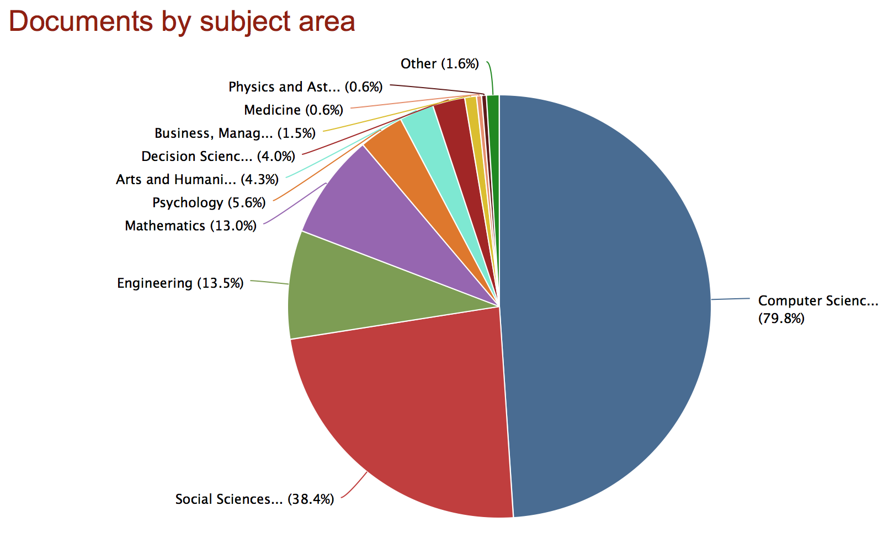
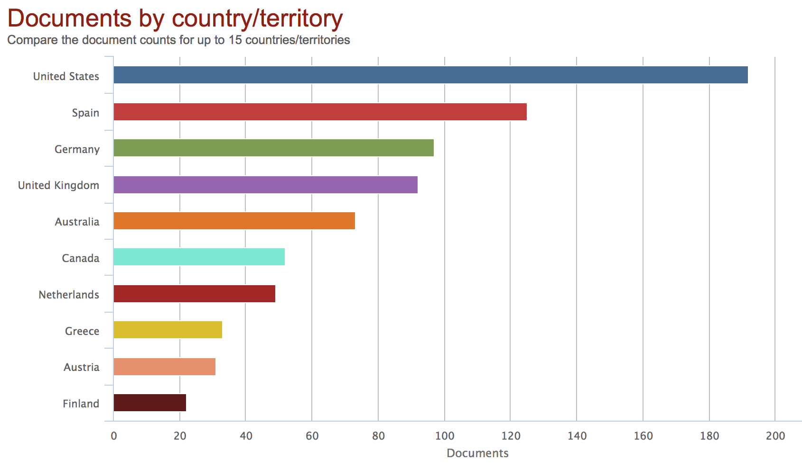
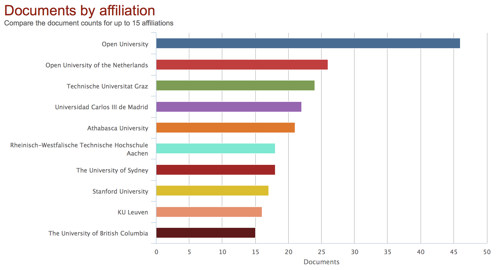

Week 1 - Introduction
========================================================
font-import: http://fonts.googleapis.com/css?family=Lato
font-family: 'Lato'
css: custom.css

## CI 5330 Section 001   Learning Analytics in the Knowledge Age

Bodong Chen  
January 19, 2016

About the Course
========================================================
incremental: true

- **One** of the first courses in Learning Analytics (LA)
  - [Big Data in Education](https://www.coursera.org/course/bigdata-edu) MOOC, Ryan Baker
  - [Data, Analytics, and Learning](https://courses.edx.org/courses/UTArlingtonX/LINK5.10x/) MOOC, George Siemens, et al.
  - (Use them as additional resources!)
- **Second** iteration at the U
- **Three** departments represented last year (C&I, Ed Psych, CS)
- _**May** the **4th** (force) be with you :)_

About Myself
========================================================

- Beijing Normal -> Peking U -> U of Toronto
- Joined *The U* in January 2015
- Research areas
  - computer-supported collaborative learning
  - learning analytics
  - online learning (MOOCs)
  - social media
- (An R hacker + a fan of reproducible research)

More on <a href="http://meefen.github.io/">http://meefen.github.io/</a>

Introduction
========================================================
type: prompt

Learning Analytics as a (Young) Field
========================================================

- First academic conference: 2011, Banff, Canada
- First summer institute: 2013, Stanford University
- First issue of its journal: 2014

Learning Analytics as a Field (cont'd)
========================================================

Google Scholar search - exact phrase

| Year        | Count |
|-------------|-------|
| - 2010      | 201   |
| 2010 - 2011 | 342   |
| 2011 - 2012 | 1,060 |
| 2012 - 2013 | 2,250 |
| 2013 - 2014 | 3,950 |
| 2014 - 2015 | 5,160 |
| 2015 - 2016 | 2,300 |

Learning Analytics as a Field (cont'd)
========================================================

Scopus search: TITLE-ABS-KEY ( "learning analytics" )

Learning Analytics as a Field (cont'd)
========================================================

Learning Analytics as a Field (cont'd)
========================================================

Learning Analytics as a Field (cont'd)
========================================================

Learning Analytics as a Field (cont'd)
========================================================

Unpacking LA
========================================================
type: section

Collaborative Drawing (5 min)

- http://bit.ly/unpackla

Important Distinctions
========================================================
incremental: true

- learning analytics vs. analysis of learning data
- analytics vs. quantitative
- big vs. small / rich vs. poor
- analytics vs. objective

Course Portal
========================================================
type: section

- Link: https://github.com/meefen/la-spring16
- Syllabus (tentative)
  - constantly updated
- Slides

A Knowledge Building Class
========================================================
incremental: true

What does it mean?

- collective responsibility
- community discourse
- solving authentic problems (vs. acquiring some knowledge)
- production of something new

So...
- You're in the driver's seat
- You're responsible to each other

Possible Themes for SIGs
========================================================

- Assessment of Domain Knowledge
- Social Networks
- Mining of Text and Discourse
- Temporality in Learning
- Prediction and Intervention
- Recommender Systems
- Visual Analytics
- Educator Practice
- ...

WG Projects
========================================================

Examples:
- xAPI/Tin Can (Recording traces of corporate learning)
- The "Bridge" (Bridging Stackoverflow with RStudio)
- Data Visualization
- LA & Pre-Service Teacher

Knowledge Forum demo
========================================================
type: section

- Link: http://bit.ly/kf-6
- New account
- Register for our community
- *Views*
- *Notes*: posting, scaffolds, building on, referencing, annotation
- Personal workspace
- (Google Chrome is the recommended browser)

Week 2: A Brief Overview
========================================================

Readings

- [Siemens, 2013)](http://abs.sagepub.com/content/57/10/1380)
- [Bienkowski et al., 2012](http://tech.ed.gov/wp-content/uploads/2014/03/edm-la-brief.pdf) __(Only pp. 25-36)__
- (optional) [Buckingham Shum, 2012](http://www.iite.unesco.org/publications/3214711/)

Activities
- KF Discussion: What is (or are) learning analytics? What isn't?
- Start to explore WG group ideas

