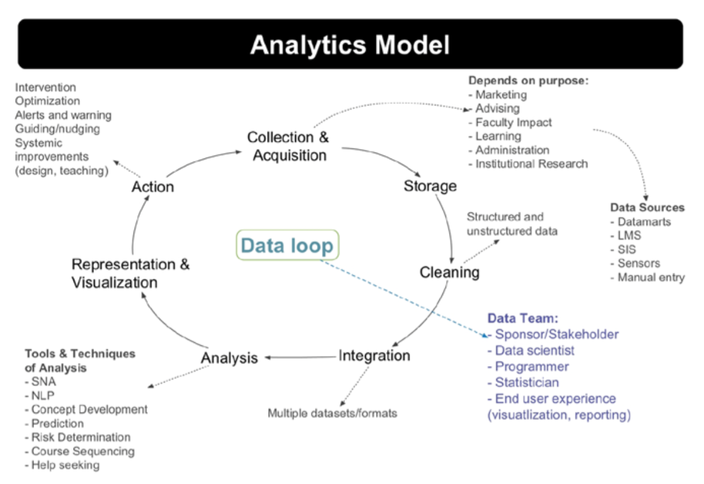
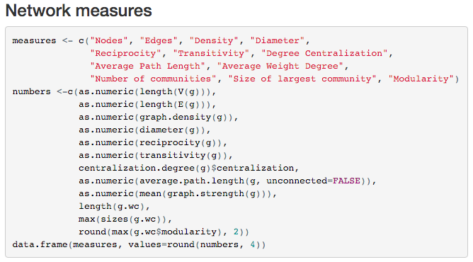

Week 2 - A Brief Overview to Learning Analytics
========================================================
font-import: http://fonts.googleapis.com/css?family=Lato
font-family: 'Lato'
css: custom.css

Bodong Chen  
January 26, 2016

Updates & Questions
========================================================

Knowledge Forum Clinic
- Issues? Questions?
- Navigate in KF
- Posting/Contributing
  - What/How: **self-contained ideas** vs. (long) reflection posts
  - Where: **dedicated views** (everyone can create views!)
  - When: **earlier if possible** (to enable knowledge *building*)

General questions?

Readings
========================================================

- Siemens, G. (2013). [Learning Analytics: The Emergence of a Discipline](http://abs.sagepub.com/content/57/10/1380). American Behavioral Scientist, 0002764213498851. doi:10.1177/0002764213498851
- Bienkowski, M., Feng, M., & Means, B. (2012). [Enhancing teaching and learning through educational data mining and learning analytics](http://tech.ed.gov/wp-content/uploads/2014/03/edm-la-brief.pdf). Washington, DC: U.S. Department of Education. __(Only pp. 25-36)__
- (optional) Shum, S. B. (2012). [UNESCO Policy Brief: Learning Analytics](http://www.iite.unesco.org/publications/3214711/). Technical Report, UNESCO Institute for Information Technologies in Education.

Reflection & Discussion
========================================================
type: section

Definition
========================================================
title: false

</img>

 

## Learning analytics is the ~~measurement, collection, analysis and reporting of data~~ about learners and their contexts, for purposes of understanding and optimizing learning and the environments in which it occurs.

Long & Siemens, 2011

Definition
========================================================
title: false

</img>

 

## Learning analytics is the measurement, collection, analysis and reporting of data about learners and their contexts, for purposes of ~~understanding and optimizing~~ learning and the environments in which it occurs.

Long & Siemens, 2011

Data Analytics Lifecycle
========================================================

Data Analytics Lifecycle (predictive)
========================================================

<a href="http://blogs.sas.com/content/subconsciousmusings/2013/01/11/why-people-and-process-matter-in-addition-to-great-technology-in-predictive-analytics/">Source</a>

Methodological Dimensions
========================================================

1. Theoretical assumptions
2. Purpose of analysis
3. Units of action, interaction, and analysis
4. Representations
  - What representations of data and representations of analytic constructs and interpretations capture these units in a manner consistent with the purposes and theoretical assumptions?
5. Analytic manipulations

(From [Productive Multivocality in the Analysis of Group Interactions](http://www.springer.com/education+%26+language/learning+%26+instruction/book/978-1-4614-8959-7), ch. 2)

LA Model
========================================================

CanvasNet as An Example...
========================================================

[Canvas](https://canvas.instructure.com/): a rising Learning Management System (LMS)

**CanvasNet**: an analytics tool aiming to provide students with feedback on their social and conceptual engagement

Theoretical assumptions
========================================================

- Social constructivist learning
- "Learning as participation" metaphor

Collection & acquisition
========================================================

Collection & acquisition
========================================================

- Canvas APIs (application programming interfaces)
- Google Scripts ([recipe](https://mashe.hawksey.info/2013/02/lak13-recipes-in-capturing-and-analyzing-data-canvas-network-discussion-activity-data/))

Storage, cleaning & integration
========================================================

- Google Sheet

- Not much cleaning or integration

Exploration & Analysis
========================================================

- **R** (a statistical programming language)
  - read data from Google Sheet
  - social network analysis: `sna` and `igraph` packages
  - text analysis: `tm` package

Representation & visualization
========================================================

Representation & visualization (2)
========================================================

Action
========================================================

- An R web application, *for*
  - students to reflect on their own participation
  - the teacher to monitor and intervene
  - ...

An iterative cycle

Week 3: Higher order Competencies
========================================================

Readings

- Scardamalia, M., Bransford, J. D., Kozma, B., & Quellmalz, E. (2012). New Assessments and Environments for Knowledge Building. In _Assessment and Teaching of 21st Century Skills (pp. 231–300)_. Springer. doi:10.1007/978-94-007-2324-5_5
- (optional) Shum, S. B., & Ferguson, R. (2012). [Social learning analytics](http://www.jstor.org/stable/jeductechsoci.15.3.3?seq=1#page_scan_tab_contents). Educational Technology and Society, 15(3), 3–26.

Activities

- Watch video [Ken Robinson: Changing education paradigms](http://www.ted.com/talks/ken_robinson_changing_education_paradigms)
- KF Discussion: *What are some of the competencies you wish to assess? Can you think of how? Any gaps?*

Housekeeping
========================================================

Ongoing LA courses at Colombia and EdinburghU

<blockquote class="twitter-tweet" lang="en">
<a href="https://twitter.com/bodong_c">@bodong_c</a> <a href="https://twitter.com/BakerEDMLab">@BakerEDMLab</a> Indeed. <a href="https://twitter.com/EdinburghUni">@EdinburghUni</a> course handbook - <a href="https://t.co/VBBgNotKDK">https://t.co/VBBgNotKDK</a> and <a href="https://twitter.com/TeachersCollege">@TeachersCollege</a> syllabus <a href="https://t.co/xz2kIZ5bT6">https://t.co/xz2kIZ5bT6</a>
&mdash; Dragan Gasevic (@dgasevic) <a href="https://twitter.com/dgasevic/status/689844162624102400">January 20, 2016</a></blockquote>

Housekeeping
========================================================

Updates on SIGs and WGs?

[Group sign-up](https://docs.google.com/spreadsheets/d/17pzgl0QY7D-47y777PkOkAMT_s3vCGS5xPYXKKfAk2U/edit) (feel free to put down your names)
