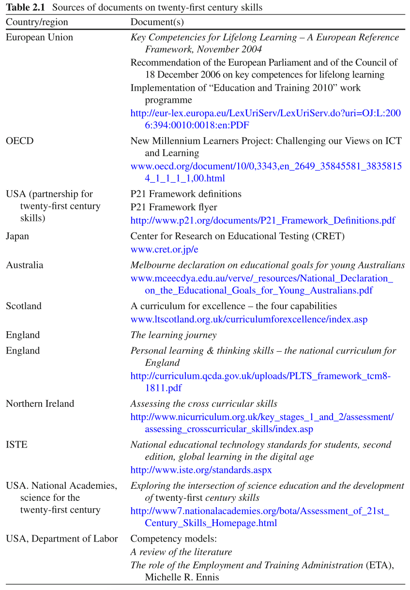
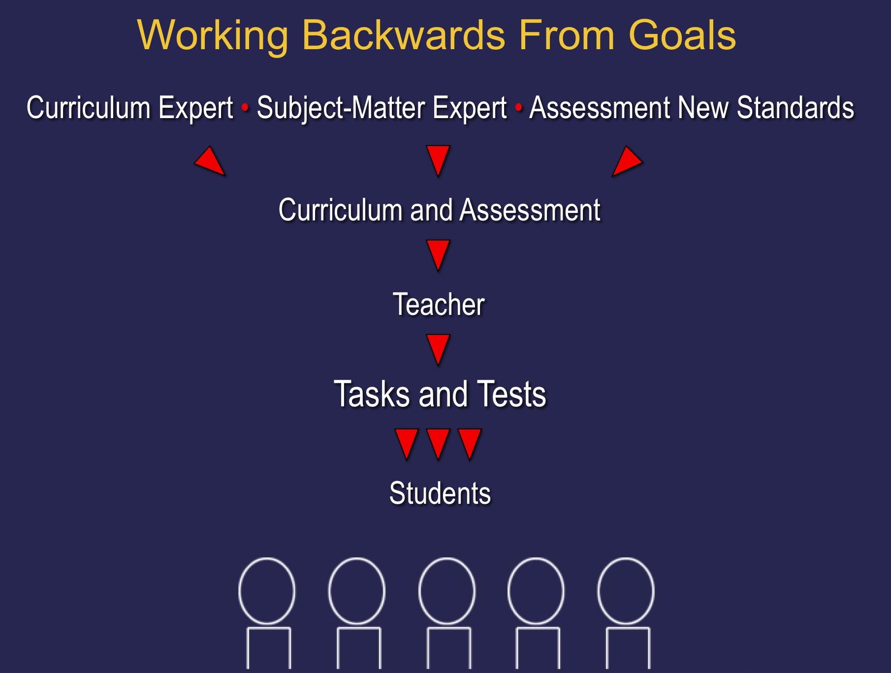
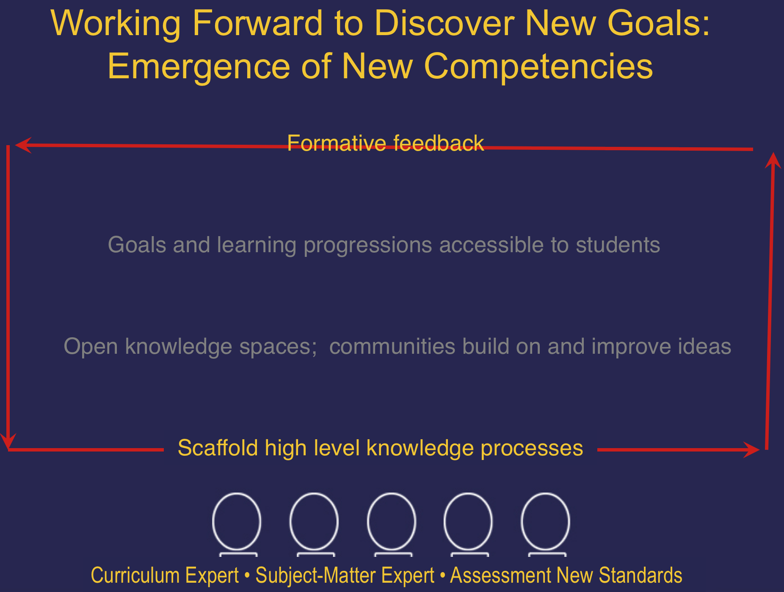
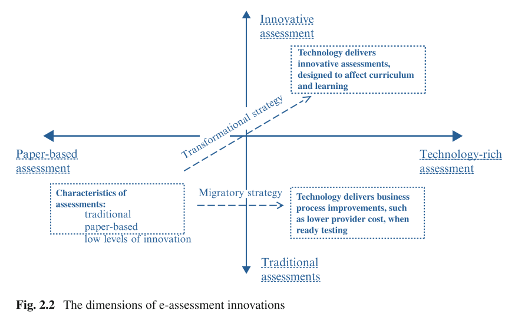
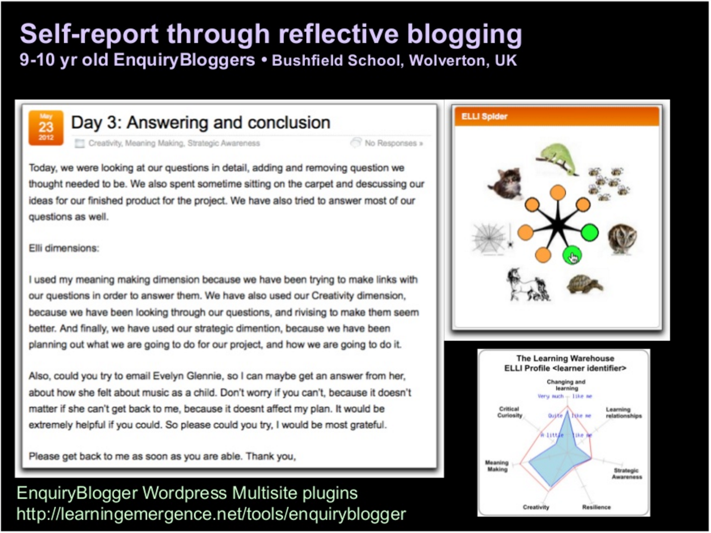

Week 3 - Higher order Competencies
========================================================
font-import: http://fonts.googleapis.com/css?family=Lato
font-family: 'Lato'
css: custom.css

Bodong Chen  
Feb 2, 2016

Reflection & Discussion
========================================================

> I was pretty shocked that there would be objections to preparing students for the "real-world". Isn't that exactly the point of education - to prepare students to be successful in today's society? 
> -- Sarah

> While most of these skills are applicable to all domains, the purpose of education goes beyond preparing students for a future job - to instill a sense of inquiry, a love for deeper learning, an ability to think critically, etc. -- Anu

no
========================================================
title: none

> NCLB certainly drove the skills-based craze with it's draconian emphasis on standardized testing in reading and math. -- Kristina

> My former principle said that part of the problem is that parents have been conditioned over the last ten years to see those standardized testing numbers as an accurate guage of the quality of thier children's schooling and they are pushing the district to continue with the emphasis on testing. -- Jenifer

"21st Century Skills"
========================================================

"21st Century Skills"
========================================================
title: none

(Binkley et al., 2012)

Working Backwards
========================================================

(Scardamalia, 2010)

Working Forward
========================================================

(Scardamalia, 2010)

How?
========================================================
title: none
type: alert

 

# How does learning analytics fit into either approach?

Assessment Innovation
========================================================

(Binkley et al., 2012)

Choice-based Assessments
========================================================

A case: Learning dispositions and transferable competencies
========================================================

- Dispositions: a personal attribute, embedded in a learning journey oscillating between personal and public
- A self-report questionnaire called ELLI (Effective Lifelong Learning Inventory)

<small>Buckingham Shum, Simon and Deakin Crick, Ruth (2012). [Learning dispositions and transferable competencies: pedagogy, modelling and learning analytics](http://oro.open.ac.uk/32823/1/SBS-RDC-LAK12-ORO.pdf). In: 2nd International Conference on Learning Analytics & Knowledge, 29 Apr - 02 May 2012, Vancouver, British Columbia, Canada.</small>

Learning dispositions and transferable competencies
========================================================

- *Learning Warehouse*; visual analytics
  

Learning dispositions and transferable competencies
========================================================

Week 4: Learning Theory
========================================================

Readings

- Wise, A. F., & Schaffer, D. W. (2015). [Why theory matters more than ever in the age of big data](http://epress.lib.uts.edu.au/journals/index.php/JLA/article/view/4677/5095). Journal of Learning Analytics, 2(2), 5–13. doi:10.18608/jla.2015.22.2
- Anderson, C. (2008, June). The end of theory: The data deluge makes the scientific method obsolete. Wired. Retrieved from http://www.wired.com/2008/06/pb-theory/
- (optional) Schneider, B., & Pea, R. (2015). [Does seeing one another’s gaze affect group dialogue A computational approach](http://epress.lib.uts.edu.au/journals/index.php/JLA/article/view/4260). Journal of Learning Analytics, 2(2), 107–133. doi:10.18608/jla.2015.22.9

Week 4: Learning Theory (cont'd)
========================================================

Activities

- KF discussion: What roles learning theory plays in analysis of learning data and in application of learning analytics?
- WG project ideas share-out
