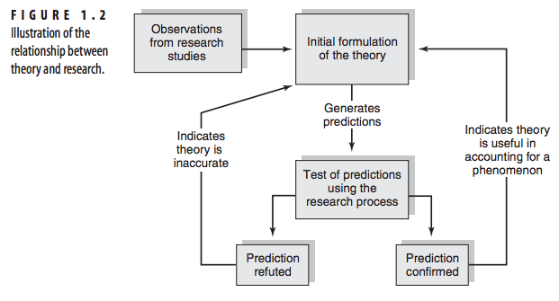

Week 4 - Learning Theory
========================================================
font-import: http://fonts.googleapis.com/css?family=Lato
font-family: 'Lato'
css: custom.css

Bodong Chen  
Feb 9, 2016

The role of theory
========================================================

- A theory is not a collection of facts; rather, it explains facts
- A good theory suggest new hypotheses (fruitfulness)

Slide With Code
========================================================
title: none

Christensen, L. B., Johnson, B., & Turner, L. A. (2011). Research methods, design, and analysis. Upper Saddle River, NJ: Pearson.

Slide With Plot
========================================================

 
