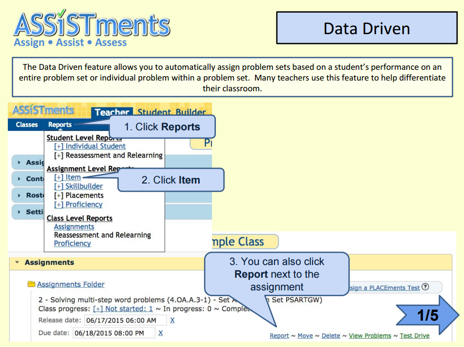
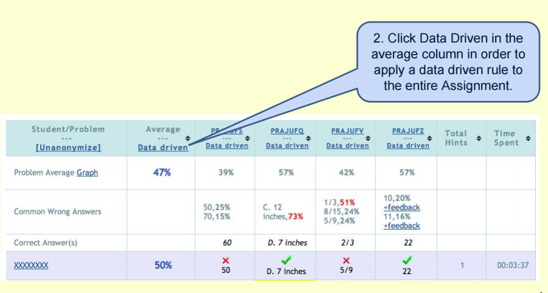
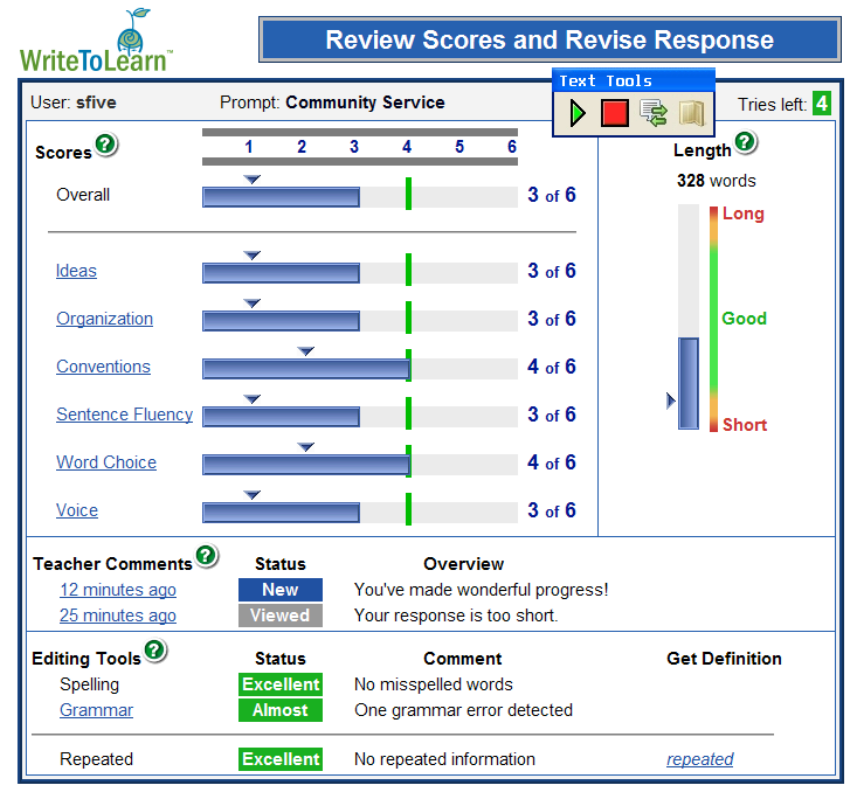

Week5: Hidden Assumptions
========================================================
font-import: http://fonts.googleapis.com/css?family=Lato
font-family: 'Lato'
css: custom.css

Bodong Chen  
Feb 16, 2016

ASSISTments - WPI
========================================================

ASSISTments - WPI (2)
========================================================

Assessment in Pearson
========================================================

https://www.youtube.com/watch?v=W_cEiRPS6rk

<iframe width="560" height="315" src="https://www.youtube.com/embed/W_cEiRPS6rk" frameborder="0" allowfullscreen></iframe>

WriteToLearn - Pearson (Foltz)
========================================================

Academic Writing Analytics - UTS
========================================================

Week 6: EDM
========================================================

Readings (in KF)

- Scheuer, O. and McLaren, B. M. (2012). Educational data mining. In Encyclopedia of the Sciences of Learning, pages 1075–1079. Springer.
- Baker, R.S.J.d., Yacef, K. (2009) The State of Educational Data Mining in 2009: A Review and Future Visions. Journal of Educational Data Mining, 1 (1), 3-17.

